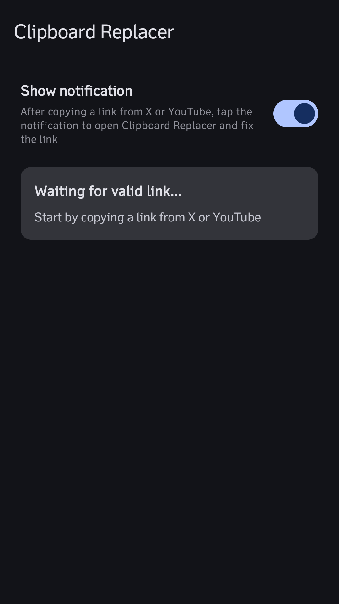
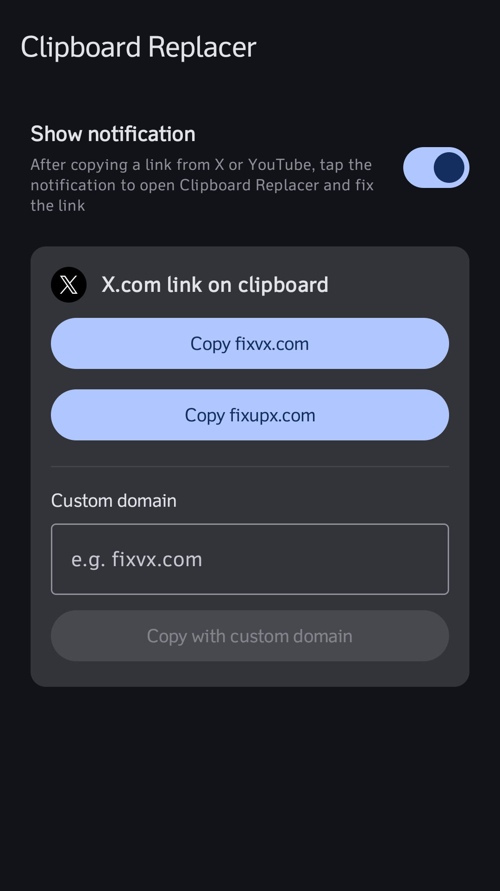
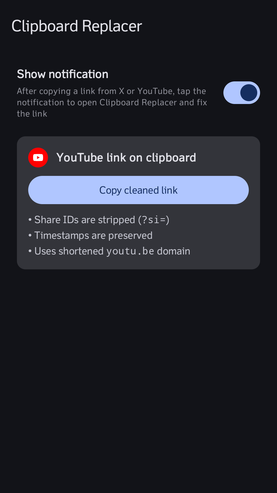

<p align="center">
  
</p>

<h1 align="center">clipboard-replacer</h1>

<p align="center">
  Android app that rewrites X / Twitter / YouTube URLs on the clipboard for better social media sharing.
</p>

## Features

- **X / Twitter:** Links become **fixvx.com**, **fixupx.com**, or a custom domain (including fix embeds).
- **YouTube:** Removes the Share ID `?si` which tracks who shared the video (YOU!), shortens to `youtu.be`, and keeps only useful params (`t`, `start`).

### How it works

Android 10+ blocks background clipboard reads. With **Show notification** on, a foreground service listens for clipboard changes and posts a prompt. Tap it to open a brief focused activity that reads, rewrites, and writes the clipboard (using your last-chosen X host).

The ongoing notification opens the main screen for manual host selection. **Copy fixed URLs** also works while the app is open (has focus).

## Screenshots
<p align="center">
  
  
  
</p>

## Sideloading a build on your device

**Preferred:** download the signed release APK from [GitHub Releases](https://github.com/andymerskin/clipboard-replacer-android/releases).

If you previously installed a **debug** build (for example `v0.1.1`), uninstall it first. Debug and release APKs use different signing keys, so Android will not upgrade one over the other.

### Local debug build

```bash
./gradlew :app:assembleDebug
```

The APK lands at:

```text
app/build/outputs/apk/debug/ClipboardReplacer-<version>-debug.apk
```

Install it one of these ways:

1. **USB / emulator (recommended):** enable USB debugging, then:

   ```bash
   ./gradlew :app:installDebug
   ```

   Or:

   ```bash
   adb install -r app/build/outputs/apk/debug/ClipboardReplacer-*-debug.apk
   ```

2. **Manual:** copy the APK to the device and open it in a file manager. Allow install from that source when prompted.

## Build

```bash
./gradlew :app:assembleDebug
./gradlew :app:testDebugUnitTest
```

For a local signed release APK, create a gitignored `keystore.properties` in the repo root:

```properties
storeFile=clipboard-replacer-release.keystore
storePassword=…
keyAlias=clipboard-replacer
keyPassword=…
```

Then:

```bash
./gradlew :app:assembleRelease
```

## Releases

Push a version tag to publish a **signed release APK** on GitHub Releases:

```bash
git tag v0.1.2
git push origin v0.1.2
```

The release workflow derives `versionName` and `versionCode` from the tag (no Gradle edit needed) and signs with repository secrets (`SIGNING_KEYSTORE_BASE64`, `SIGNING_STORE_PASSWORD`, `SIGNING_KEY_ALIAS`, `SIGNING_KEY_PASSWORD`). CI runs unit tests on pull requests and pushes to `main`.

## Requirements

- **Device:** Android 8.0+ (API 26; see `minSdk` in `app/build.gradle.kts`)
- **Build:** Android Studio Ladybug+ (or equivalent AGP 9.3 toolchain), JDK 17, Android SDK 37

## Project layout

- `UrlRewriter` — pure URL transforms (unit tested)
- `AppPrefs` — SharedPreferences for monitoring toggle, custom X domain, last rewrite host
- `ClipboardHelper` — clipboard read/write plus self-write prompt suppression
- `ClipboardMonitorService` — FGS + clipboard listener + notifications
- `ClipboardFixActivity` — translucent focus activity for one-tap rewrite from the prompt
- `MainActivity` — toggle monitoring + manual fix / host selection

## Todos

- [x] CI / CD for testing and building a debug APK for GitHub Releases
- [x] Clean up typography and other UI cruft
- [x] Signed release APKs on GitHub Releases
